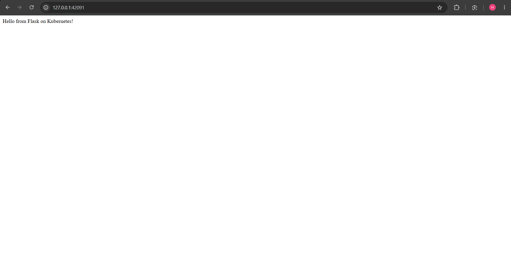

# Exercise 2

## Steps of Execution

### Run The following commands:

#### Create a minikube server :
```bash
minikube start
```
#### Build the Docker Image with Minikube’s Docker Daemon:
```bash
minikube docker-env
eval $(minikube docker-env)
docker build -t flask-app .
```

#### 1. Create a Kubernetes Deployement

```bash
kubectl apply -f flask-deployment.yaml
```

#### 2. Check Deployment Status

```bash
kubectl get deployments
```

##### Output :

```bash
NAME        READY   UP-TO-DATE   AVAILABLE   AGE
flask-app   1/1     1            1           9s
```

#### 3. Verify Pods Created by the Deployment

```bash
kubectl get pods -l app=flask-app
```
##### Output :

```bash
NAME                         READY   STATUS    RESTARTS   AGE
flask-app-6d58f88547-mw8k5   1/1     Running   0          19s
```

#### 4. Describe the Deployment

```bash
kubectl describe deployment flask-app
```

##### Output :

```bash
Name:                   flask-app
Namespace:              default
CreationTimestamp:      Sat, 12 Sep 2026 14:51:42 +0000
Labels:                 <none>
Annotations:            deployment.kubernetes.io/revision: 1
Selector:               app=flask-app
Replicas:               1 desired | 1 updated | 1 total | 1 available | 0 unavailable
StrategyType:           RollingUpdate
MinReadySeconds:        0
RollingUpdateStrategy:  25% max unavailable, 25% max surge
Pod Template:
  Labels:  app=flask-app
  Containers:
   flask-app:
    Image:         flask-app:latest
    Port:          15000/TCP
    Host Port:     0/TCP
    Environment:   <none>
    Mounts:        <none>
  Volumes:         <none>
  Node-Selectors:  <none>
  Tolerations:     <none>
Conditions:
  Type           Status  Reason
  ----           ------  ------
  Available      True    MinimumReplicasAvailable
  Progressing    True    NewReplicaSetAvailable
OldReplicaSets:  <none>
NewReplicaSet:   flask-app-6d58f88547 (1/1 replicas created)
Events:
  Type    Reason             Age   From                   Message
  ----    ------             ----  ----                   -------
  Normal  ScalingReplicaSet  29s   deployment-controller  Scaled up replica set flask-app-6d58f88547 from 0 to 1
```

#### 5. View Deployment Logs

```bash
kubectl logs flask-app-6d58f88547-mw8k5
```
##### Output :

```bash
 * Serving Flask app 'app'
 * Debug mode: off
WARNING: This is a development server. Do not use it in a production deployment. Use a production WSGI server instead.
 * Running on all addresses (0.0.0.0)
 * Running on http://127.0.0.1:15000
 * Running on http://10.244.0.4:15000
Press CTRL+C to quit
```

#### 6. Check Services

```bash
kubectl get services
```
##### Output :

```bash
NAME         TYPE        CLUSTER-IP   EXTERNAL-IP   PORT(S)   AGE
kubernetes   ClusterIP   10.96.0.1    <none>        443/TCP   9m2s
```

### Make Changes into the \flask-deployment.yaml and execute the following command :

```bash
kubectl apply -f flask-deployment.yaml
```
##### Output : 

```bash
deployment.apps/flask-app unchanged
service/flask-app-service created
```
Once the service is created run the following command to make the service accessible

```bash
minikube service flask-app-service --url
```

##### Output :
```bash
http://127.0.0.1:42091
❗  Because you are using a Docker driver on linux, the terminal needs to be open to run it.
```

### Output Screenshot : 


