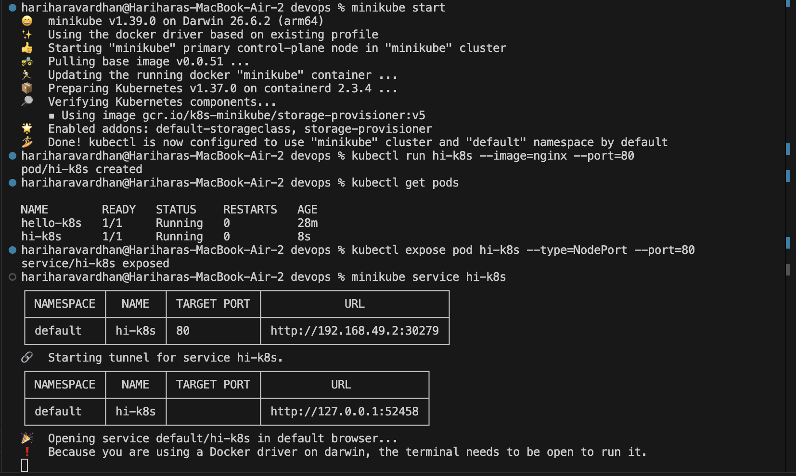
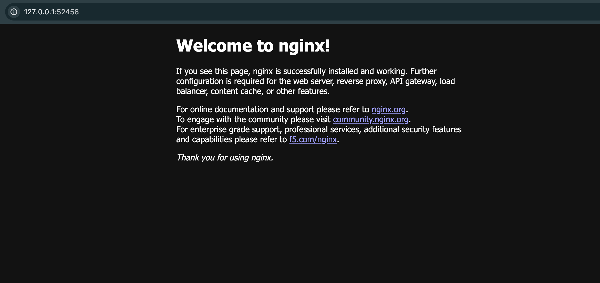

# Exercise 1: Deploying and Exposing an Nginx Web Server on Minikube

## Objective
To set up a local single-node Kubernetes cluster using **Minikube**, deploy a containerized **Nginx** web server pod, expose it to external traffic using a **NodePort Service**, and access the web application in a browser.

---

## Prerequisites
Ensure the following tools are installed and configured:
- [Minikube](https://minikube.sigs.k8s.io/)
- [kubectl](https://kubernetes.io/docs/tasks/tools/)
- A virtualization/container driver (e.g., Docker, Colima, or Podman)

---

## Steps of Execution

### Step 1: Start the Local Kubernetes Cluster
Initialize and start the local single-node Minikube cluster:
```bash
minikube start
```
> **Explanation**: This starts the local Kubernetes control plane node and configures `kubectl` context to manage the cluster.

---

### Step 2: Deploy the Nginx Pod
Create and run a new Kubernetes pod named `hi-k8s` using the official `nginx` container image:
```bash
kubectl run hi-k8s --image=nginx --port=80
```
> **Explanation**: The `kubectl run` command creates a pod running the Nginx container listening on port `80`.

---

### Step 3: Verify the Pod Status
Check the status of the newly created pod:
```bash
kubectl get pods
```
> **Explanation**: Confirms that the pod is in the `Running` state and ready to accept traffic.

---

### Step 4: Expose the Pod via a NodePort Service
Expose the pod to external traffic by creating a Kubernetes `NodePort` Service:
```bash
kubectl expose pod hi-k8s --type=NodePort --port=80
```
> **Explanation**: Creates a Service resource of type `NodePort` targeting port 80 of the `hi-k8s` pod.

---

### Step 5: Access the Service in the Web Browser
Launch the service tunnel and open the web page in your default browser:
```bash
minikube service hi-k8s
```
> **Explanation**: Generates an accessible tunnel URL (e.g., `http://127.0.0.1:52458`) and automatically opens it in the browser.

---

## Output

### 1. Terminal Execution


---

### 2. Browser Output

